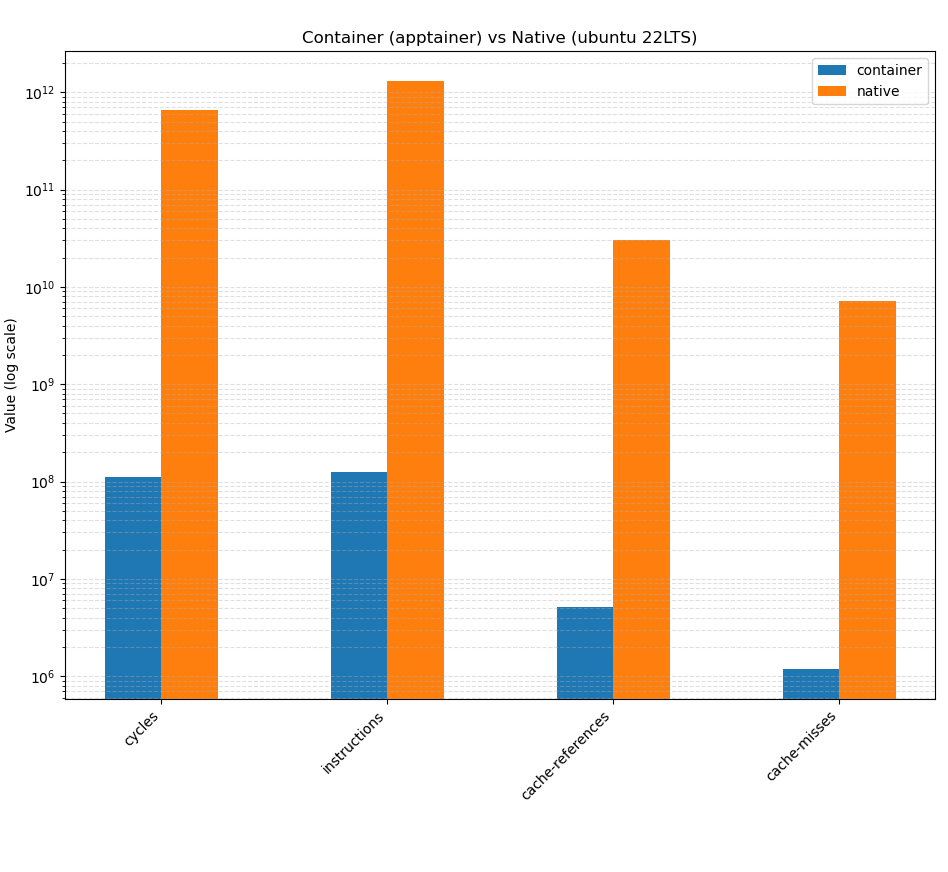

_This blog will have a few "sidequest" sections, they are optional so skip for a
read._

In university, I was lucky enough where I got to participate in some HPC (High Performance Computing).
Where I battled good ol' dependancy hell. I managed to get the app working and to not go through 
that again I decided to containerize :sparkle:.
Specifically, Apptainer containers which are designed with HPC in mind.
Happy that I was able to get it containerized, I moved onto the next step benchmarking/profiling.
For that Linux has a lovely tool called [perf](https://perfwiki.github.io/main/) (some fun
perf examples can be found [here](https://www.brendangregg.com/perf.html))
that can extract kernel stats of processes. Things like CPU cycles or the number of
cache misses. With the native and container verson running I decided to compare runs.
Containers have reportedly about a 5% overhead so I was hoping to see that.
Instead... MY CONTAINER IS EATING MY INSTRUCTIONS?!?



The difference in many orders of magnitue means something is wrong. Either perf is asleep at
the wheel or I don't understand how containers really work under the hood.

If I were a betting man, I'd bet on the latter.

> ## Sidequest: but really, what are containers?
> I first encountered containers as a lightweight alternative to Virtual Machines (VMs).
> But how?? Like a VM encapsulates the code by running a whole guest kernel (sometimes hardware)
> and guest OS ontop of your host OS. Like sure somehow we glue the guest to the host
> with software. Isolation is achieved! But how do you make that lighter?
> What magic is being used? The secret is the Linux kernel provides isolation
> primitives. So then, docker, podman, apptainer are just wrappers around those
> kernel isolation features. For example it manages the isolation levels, creates
> an isolated environment, manages resources etc. The two main kernel features
> are **namespaces** for isolation and **cgropus** for resource management and
> accounting. (tangent: For creating secure/hardened containers look at
> capabilities for permissions, AppArmour/LinuxSE for security system,
> and setcomp bpf for banning dangerous syscalls)

Ok so it seems that when perf tries to trace the container application's PID
it doesn't trace the subprocesses. So then if containers use cgroups for resource allocation and
monitoring, how do we check what it's monitoring? After traversing documentation
on cgroups, perf and alike, I found the "`perf stat`" flag "`--cgroup`" that can
filter perf events by cgroup name. AMAZING! but... ummm what's a cgroups name?
It turns out to simply be the filepath of the container directory after "`/sys/fs/cgroup`".
So for the cgroup found in `/sys/fs/cgroup/user.slice/user-1000.slice/user@1000.service/user.slice/ apptainer-30443`,
the name is `user.slice/user-1000.slice/user@1000.service/user.slice/ apptainer-30443`

> ## Sidequest: cgroup names and management
> This long name above, why? Well that is because Apptainer uses systemd to manage
> cgroups. But there's is a more hacky way to make cgroups:
> ```bash
> sudo mkdir -p /sys/fs/cgroup/bench
>
> # $$ gets pid of the new shell spawned with "-c"
> bash -c '
>   echo $$ | sudo tee /sys/fs/cgroup/bench/cgroup.procs >/dev/null
>   exec stress-ng --cpu 0 -t 60s &
> '
> 
> perf stat -a \
>   -e cycles,instructions,cache-misses,minor-faults,major-faults \
>   -G bench \
>   -- sleep 60
> ```


So then the final perf command will be:
```bash
perf stat -a \ # record system wide
  -e cycles,instructions,cache-misses,minor-faults,major-faults \ # an example selection of counters
  -G $CGROUP_NAME \  # filter by cgroup name
  -- sleep 60 # wait some time for program to complete
```

> ## Sidequest: to sudo or not to sudo
> Running perf with admin privelleges gets us over the hump and gets perf running.
> But now, we don't understand why perf needs those privellages in the first
> place. The privelleges are needed because performance counters are A. a limited
> resource for the kernel and B. can be considered sensitive data. So not every
> user program should have access for those reasons. However, instead of sudo,
> perf privelleges can be granted by either changing the system setting:
> `kernel.perf_event_paranoid` to be more permissive or by giving perf the cap
> CAP_PERFMON, CAP_SYS_PTRACE or CAP_SYS_ADMIN. These same settings are also
> referenced when perf runs without sudo and aborts on permissions error.

---

## Appendix
1. Fun talk on [perf and containers](https://www.youtube.com/watch?v=NYLXZ58EboM)
2. Fun talk on [history of containers](https://www.youtube.com/watch?v=hgN8pCMLI2U)
